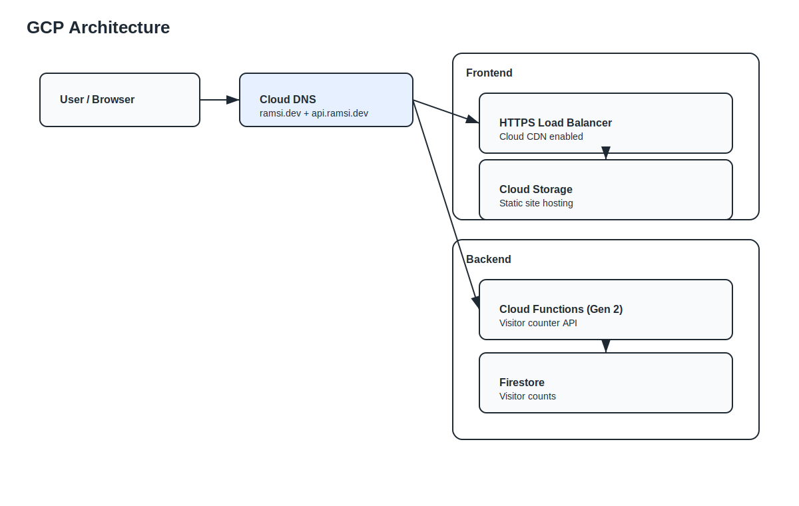
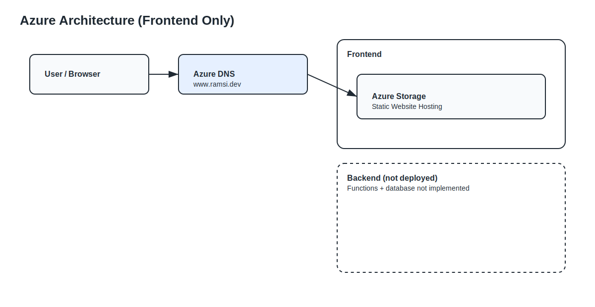

# cloud-resume-challenge

Multi-cloud Cloud Resume Challenge with a MkDocs frontend and a serverless visitor counter. AWS and GCP are fully implemented. Azure currently includes frontend-only infrastructure.

## Architecture

AWS

- Frontend: S3 + CloudFront + Route 53
- Backend: API Gateway + Lambda + DynamoDB

GCP

- Frontend: Cloud Storage + HTTPS Load Balancer + Cloud CDN + Cloud DNS
- Backend: Cloud Functions (Gen 2) + Firestore

Azure

- Frontend: Azure Storage Static Website + Azure DNS
- Backend: Not deployed (subscription-level quota constraints on App Service plans; frontend implemented to validate infra parity)

## Architecture diagrams

AWS  


GCP  


Azure  


## Repo layout

```text
docs/                          MkDocs source
docs/assets/js/visitor-counter.js  Visitor counter client
aws/                           AWS Terraform (frontend, backend, state)
gcp/                           GCP Terraform (frontend, backend)
azure/                         Azure Terraform (frontend only)
```

## Prerequisites

- Terraform >= 1.7
- Python 3.11 and MkDocs (mkdocs-material, mkdocs-blog-plugin)
- AWS CLI (configured)
- Google Cloud SDK (gcloud, gsutil)

## Build the site

```bash
mkdocs build
```

Output goes to `site/` (not committed).

## Terraform state (AWS)

AWS state is remote in S3 with DynamoDB locking. Bootstrap it first:

```bash
cd aws/state
terraform init
terraform apply
```

Other AWS stacks reference that remote state.

## Deployments

### AWS

Backend

```bash
cd aws/backend
terraform init
terraform apply
```

Frontend

```bash
cd aws/frontend
terraform init
terraform apply
./deploy.sh
```

Notes

- `aws/frontend/deploy.sh` uses hardcoded S3 bucket and CloudFront distribution IDs.
- Update those values if you recreate resources.

### GCP

Backend

```bash
cd gcp/backend
./deploy.sh
```

Frontend

```bash
cd gcp/frontend
terraform init
terraform apply
./deploy.sh
```

Notes

- `gcp/frontend/deploy.sh` uses hardcoded bucket name and URL map.
- Update those values if you recreate resources.

### Azure (frontend only)

```bash
cd azure/frontend
terraform init
terraform apply
./deploy.sh
```

Notes

- Apex domain is not supported directly by Azure Storage static websites.
- Use `www.ramsi.dev` as the primary URL.
  Notes
- Backend deployment was explored but blocked by subscription-level quota limits on App Service plans.
- Frontend-only deployment was completed to validate Azure static hosting and DNS configuration.

## API endpoint selection

The frontend reads the visitor counter API from `docs/assets/js/visitor-counter.js`.
Update `API_ENDPOINT` to match the cloud you are using:

- AWS: `https://api.ramsi.dev/visitor-count`
- GCP: use `terraform output api_endpoint` from `gcp/backend`

## Local testing

```bash
mkdocs serve
```

Update `API_ENDPOINT` to a reachable backend before testing.

## GitHub Actions (CI/CD)

Workflows

- `.github/workflows/state.yml`: AWS state + OIDC setup (manual trigger only)
- `.github/workflows/frontend.yml`: builds MkDocs and deploys to S3 + CloudFront
- `.github/workflows/backend.yml`: applies AWS backend Terraform

Required AWS setup

- Deploy `aws/state` first to create the GitHub Actions OIDC role and state bucket.
- The role ARN is output by `aws/state` and referenced in workflows.

Secrets

- No long-lived AWS secrets required (OIDC is used).

## Related blog posts

- AWS: [Terraform AWS setup](docs/blog/posts/terraform-aws-setup.md)
- AWS: [Static website infrastructure](docs/blog/posts/aws-static-website-infrastructure.md)
- GCP: [Deploying to GCP](docs/blog/posts/deploying-multi-cloud-resume-to-gcp.md)
