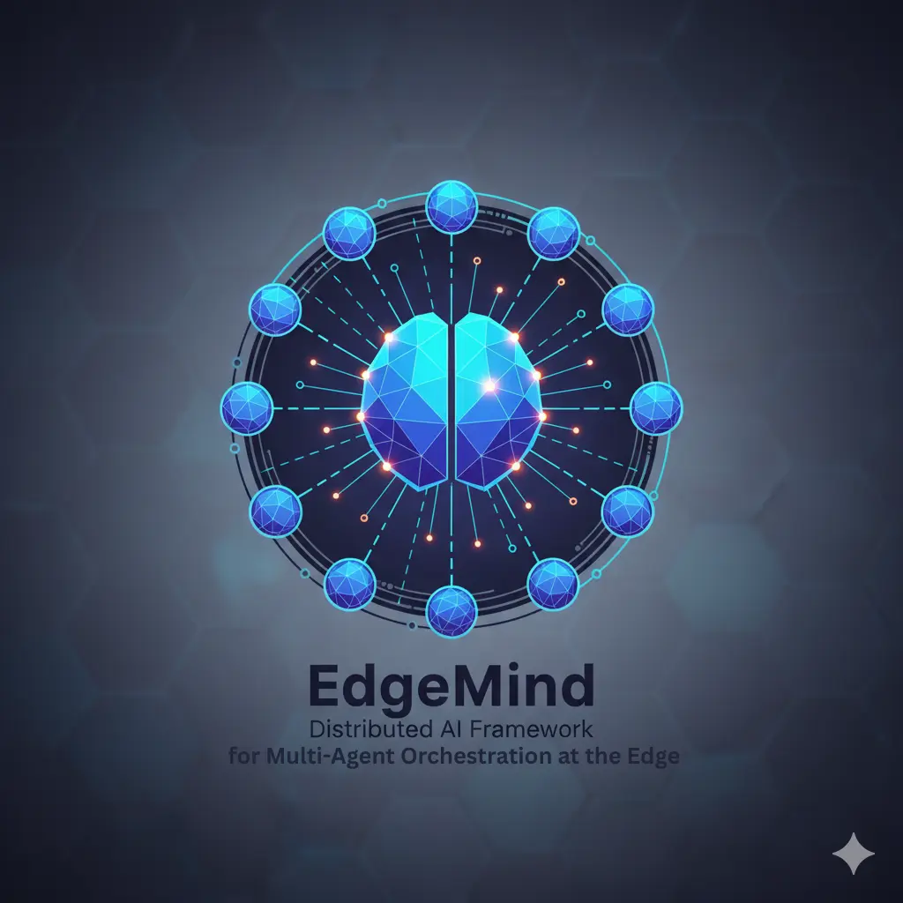

# EdgeMind: 5G-MEC Intelligence Orchestration



**Real-time AI orchestration at telecom edge with Strands agent swarms. Brings intelligence to 5G Multi-access Edge Computing sites for sub-100ms decision making.**

<div class="section-label">Live Demo</div>

[Interactive Dashboard](https://ramsik-edgemind.streamlit.app/)

---

## Project Overview

Built a 5G-MEC (Multi-access Edge Computing) orchestration system that deploys Strands-based multi-agent swarms directly at telecom edge sites. The system monitors local metrics, detects performance degradation, and self-orchestrates routing and resource decisions without cloud dependence.

<div class="section-label">Problem Statement</div>

Today's AI systems trade speed for intelligence. Edge devices process fast but lack complexity; the cloud processes deeply but adds latency. For real-time applications—autonomous vehicles, industrial control, or competitive gaming—milliseconds matter.

<div class="section-label">Solution</div>

EdgeMind brings intelligence to the edge through threshold-based orchestration, MEC-native intelligence, and swarm coordination—all achieving sub-100ms routing decisions.

---

## Key Innovation

### Threshold-Based Orchestration

- Monitors latency, CPU/GPU load, and queue depth
- Triggers intelligent swarm responses automatically
- Adapts to network conditions in real-time
- No cloud dependency for critical decisions

### MEC-Native Intelligence

- Strands agents deployed directly at telecom edge sites
- Located near RAN (Radio Access Network) controllers
- Complete agent set at each MEC site
- Local MCP tools for metrics and operations

### Swarm Coordination

- Agents collaborate across MEC sites
- Balance load without cloud involvement
- Autonomous failover between sites
- Consensus-based decision making

### Real-Time Performance

- Sub-100ms routing decisions
- 99.9% availability through redundancy
- Autonomous load balancing
- Intelligent adaptation to conditions

---

## Architecture & Technical Approach

### System Flow

```text
User Devices (5G)
  → MEC Site A (Primary)
  → Swarm Coordination
  → MEC Sites B & C (Fallback)
  → AWS Cloud (Passive Observer)
```

### MEC Site Components

Each MEC site contains:

**Complete Strands Agent Set:**

- Orchestrator Agent
- Load Balancer Agent
- Resource Monitor Agent
- Decision Coordinator Agent
- Cache Manager Agent

**Local MCP Tools:**

- metrics_monitor
- container_ops
- inference_engine
- telemetry_logger
- memory_sync

### Agent Architecture

| Agent                          | Role                                    | Deployment           |
| ------------------------------ | --------------------------------------- | -------------------- |
| **Orchestrator Agent**         | Threshold monitoring & swarm triggering | MEC Site Controller  |
| **Load Balancer Agent**        | Distribute workload across MEC sites    | Strands Swarm Member |
| **Resource Monitor Agent**     | Track CPU/GPU/latency metrics           | Strands Swarm Member |
| **Decision Coordinator Agent** | Coordinate swarm consensus              | Strands Swarm Member |
| **Cache Manager Agent**        | Local model and data caching            | Strands Swarm Member |

---

## Business Use Cases

### Gaming & Esports

- **Real-time NPC dialogue**: Device SLM for instant responses
- **Game state analysis**: MEC swarm coordination for regional multiplayer
- **Performance analytics**: Cloud observability (passive)
- **High GPU usage**: 85-95% utilization for rendering and AI

### Autonomous Vehicles

- **Collision detection**: Device SLM for ultra-low latency safety (<30ms)
- **Traffic coordination**: MEC orchestrator manages regional traffic flow
- **Fleet analytics**: Cloud monitoring and long-term insights
- **V2X communication**: Vehicle-to-everything coordination

### Smart Cities & IoT

- **Sensor processing**: Device SLM for immediate responses
- **City-wide coordination**: MEC swarm balances infrastructure load
- **Urban planning**: Cloud analytics from aggregated MEC data

### Healthcare

- **Patient monitoring**: 50-200 patients per MEC site
- **HIPAA compliance**: Local processing for privacy
- **Medical alerts**: Real-time critical event detection

---

## Technology Stack

- **Edge Agents**: Strands framework with Claude 3.5 Sonnet integration
- **AI Model**: Claude API for real agent coordination
- **MEC Infrastructure**: Docker/Kubernetes on edge compute nodes
- **Dashboard**: Streamlit with real-time simulation and dual-mode operation
- **Orchestration**: Threshold-based swarm coordination with MCP tools
- **AWS Integration**: AgentCore Memory + Orchestration only (passive)
- **Communication**: Direct MEC-to-MEC networking

---

## Live Dashboard Features

### Dual-Mode Operation

- **Mock Data Mode**: No API key required, simulated agents
- **Real Strands Agents Mode**: Full Claude API integration

### Real-Time Metrics

- Latency (ms) — target <100ms
- CPU Usage — trigger >80%
- GPU Usage — monitoring utilization
- Queue Depth — request backlog

### Swarm Visualization

- Green: Healthy MEC sites
- Red: Overloaded sites
- Gray: Failed sites
- Lines: MEC interconnections

### Agent Activity Stream

- Info: Normal operations
- Success: Consensus achieved
- Warning: Threshold breach
- Error: System failure

### Enhanced Demo Scenarios

**Gaming**: High GPU usage (85-95%), multiplayer synchronization, NPC AI processing

**Automotive**: Ultra-low latency (<30ms), safety-critical systems, V2X communication

**Healthcare**: Patient monitoring (50-200 patients), HIPAA compliance, medical alerts

**Normal**: Balanced resource utilization and standard MEC operations

### Automated Demo Mode

- Cycles through all scenarios every 15 seconds
- Scenario-specific metrics and thresholds
- Enhanced visualizations with context-aware indicators
- Start/Stop controls for presentation mode

---

## Skills Demonstrated

**5G/MEC Architecture**: Multi-access edge computing, RAN integration, telecom infrastructure, edge deployment

**Multi-Agent Systems**: Strands framework, swarm coordination, consensus algorithms, agent orchestration

**Real-Time Systems**: Sub-100ms latency targets, threshold-based triggering, performance optimization

**Distributed Systems**: MEC-to-MEC networking, failover mechanisms, load balancing, redundancy

**Cloud Integration**: AWS AgentCore, passive observability, hybrid edge-cloud architecture

**Dashboard Development**: Streamlit, real-time visualization, dual-mode operation, automated demos

**DevOps**: Docker/Kubernetes, edge deployment, monitoring, telemetry

**MCP Protocol**: Tool design, metrics monitoring, container operations, inference engines

---

## Expected Outcomes

- **Sub-100ms decision making** for real-time applications
- **Autonomous load balancing** without cloud dependency
- **99.9% availability** through MEC site redundancy
- **Intelligent swarm coordination** adapting to network conditions

---

## Future Work: ICEO Framework

The next phase extends toward ICEO (Intelligence-Centric Edge Orchestration), where each MEC site acts as a learning agent within a distributed intelligence fabric.

**Planned Research:**

- Multi-MEC simulation for latency and consensus testing
- Reinforcement-based learning between edge and cloud layers
- Formalize and publish ICEO as a framework for autonomous 5G orchestration

---

## Links

- **GitHub**: [mec-inference-routing](https://github.com/Ramsi-K/mec-inference-routing)
- **Live Demo**: [Interactive Dashboard](https://ramsik-edgemind.streamlit.app/)
- **Architecture Guide**: [Full Documentation](https://github.com/Ramsi-K/mec-inference-routing/blob/main/architecture/ARCHITECTURE_GUIDE.md)
- **Demo Scenarios**: [Enhanced Scenarios](https://github.com/Ramsi-K/mec-inference-routing/blob/main/docs/DEMO_SCENARIOS.md)

---

[← Back to Projects](index.md)
