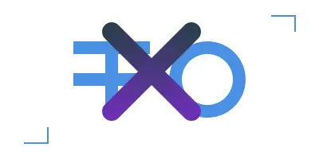

# Projects

Welcome to my project showcase! Here you'll find a collection of my work in AI engineering, cloud architecture, and multi-agent systems.

---

## Featured Projects

  <a href="yoga-rag/" class="project-card">
    

      <h3 class="project-card__title">Yoga Assistant Knowledge RAG</h3>
      
An end-to-end retrieval-augmented generation system for yoga knowledge. Achieved 23% MRR improvement through hybrid retrieval and benchmarked multiple LLMs for optimal performance.

      
<strong>Technologies:</strong> Python, BM25, sentence-transformers, DeepSeek-V3, Docker, Grafana

    

    
  </a>

  <a href="hagxwon/" class="project-card">
    

      <h3 class="project-card__title">HagXwon AI Learning Platform</h3>
      
MBA + AI enterprise architecture for Korea's $20B+ hagwon industry. Designed business strategy and built 8 working AI prototypes using local models (Ollama).

      
<strong>Technologies:</strong> TOGAF, Ollama, RAG, TTS, ASR, Computer Vision, Multi-Agent Systems

    

    
  </a>

  <a href="edgemind/" class="project-card">
    

      <h3 class="project-card__title">EdgeMind 5G-MEC Orchestration</h3>
      
Real-time AI orchestration at telecom edge with Strands agent swarms. Sub-100ms decision making for 5G Multi-access Edge Computing sites.

      
<strong>Technologies:</strong> Strands, Claude 3.5, MCP, Docker/Kubernetes, Streamlit

    

    
  </a>

---

## More Projects

  <a href="cloud-resume-challenge/" class="project-card">
    

      <h3 class="project-card__title">Cloud Resume Challenge</h3>
      
A multi-cloud resume website deployed across AWS, Azure, and Google Cloud Platform. Features include visitor counters, AI-powered Q&A, and semantic search - all managed with Terraform and CI/CD pipelines.

      
<strong>Technologies:</strong> AWS, Azure, GCP, Terraform, Python, JavaScript, MkDocs

    

    
  </a>

  <a href="mcp-albumentations/" class="project-card">
    

      <h3 class="project-card__title">MCP Albumentations</h3>
      
MCP-compliant image augmentation server with VLM integration. Enables reproducible computer vision experiments through structured JSON tools.

      
<strong>Technologies:</strong> Python, Albumentations, MCP, Gemini 2.5 Flash, PyPI

    

    
  </a>

  <a href="knowledge-graph-agents/" class="project-card">
    

      <h3 class="project-card__title">Dynamic Knowledge Graph Agents</h3>
      
Multi-agent system that transforms unstructured text into structured, visual knowledge graphs using Google ADK and code execution.

      
<strong>Technologies:</strong> Google ADK, Gemini 2.5, NetworkX, Matplotlib, FastAPI

    

    
  </a>

  <a href="discord-mcp/" class="project-card">
    

      <h3 class="project-card__title">Discord MCP Server</h3>
      
Alpha-stage MCP server for Discord with intelligent workflows. Features campaign management, natural language discovery, and swarm coordination.

      
<strong>Technologies:</strong> Python, Discord.py, MCP, Strands, SQLite, Jinja2

    

    
  </a>

  <a href="korean-learning-mud/" class="project-card">
    

      <h3 class="project-card__title">Korean Learning MUD Game</h3>
      
Interactive Korean language learning through AI-powered family members in a retro MUD-style game. Live on Hugging Face Spaces.

      
<strong>Technologies:</strong> CrewAI, OpenAI GPT, FastAPI, Docker

    

    
  </a>

---

Check out my [GitHub profile](https://github.com/Ramsi-K) for more projects and contributions!
