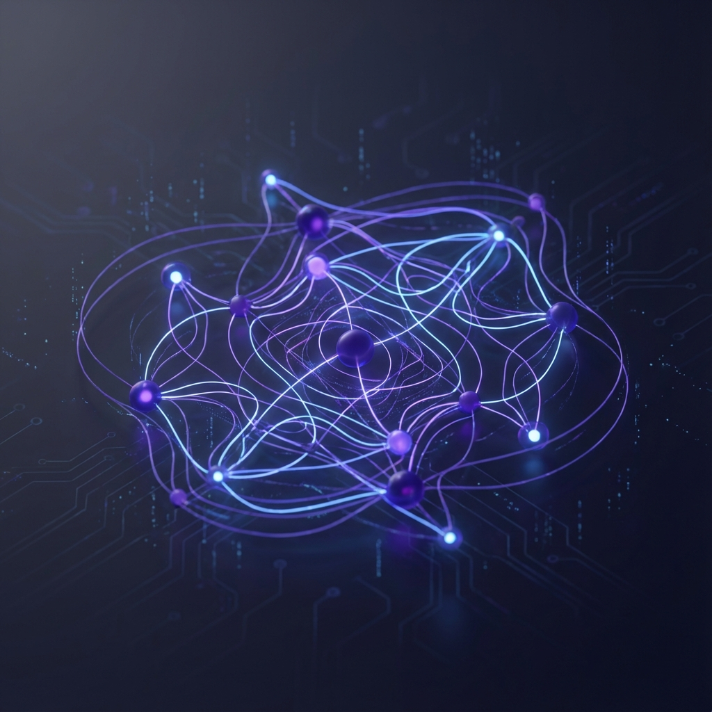

# Dynamic Knowledge Graph Agents



**Multi-agent system that transforms unstructured text into structured, visual knowledge graphs. Bridges the gap between natural language and data visualization.**

---

## Project Overview

Built a multi-agent AI system using Google Agent Development Kit (ADK) that automatically researches topics, extracts structured relationships, and generates visual knowledge graphs. The system combines sequential agents, structured ontology extraction, and code execution to create interactive visualizations of complex information.

<div class="section-label">Problem Statement</div>

Information overload makes it difficult to understand complex systems. While LLMs can summarize text, they produce linear outputs that are hard to visualize structurally. Understanding relationships in novels, ecosystems, or corporate structures requires a map, not just text.

<div class="section-label">Solution</div>

An AI agent pipeline that transforms unstructured natural language into structured, visual knowledge graphs through research, structuring, and visualization.

---

## Key Features

### Multi-Agent Architecture

#### ResearchAgent (The Librarian)

- Gathers information and synthesizes rich textual summaries
- Model: Gemini 2.5 Flash Lite
- Provides context for ontology extraction

#### OntologyAgent (The Structurer)

- Analyzes text and extracts structured triplets (Subject → Predicate → Object)
- Tools: `add_triplet`, `get_graph_state`
- Builds formal knowledge graph representation

#### VisualizationAgent (The Artist)

- Converts graph state into visual assets
- Code Execution: Writes Python code using `networkx` and `matplotlib`
- Renders graphs to PNG files with multiple layout algorithms

### Visualization Styles

Multiple layout algorithms for different data types:

- **Barnes Hut** (Default) - Force-directed layout for general graphs
- **Force Atlas 2** - Community detection and clustering
- **Repulsion** - Emphasizes node separation
- **Hierarchical** - Mind map style for tree structures

### Interactive UI

- Streamlit frontend for user interaction
- FastAPI backend for agent orchestration
- Real-time graph generation
- Multiple export formats

---

## Architecture & Technical Approach

### System Flow

```text
User Query
  → ResearchAgent (Gather Information)
  → OntologyAgent (Extract Triplets)
  → VisualizationAgent (Generate Graph)
  → PNG Output
```

### Technology Stack

- **Google ADK**: Agent Development Kit for multi-agent orchestration
- **Gemini 2.5 Flash Lite**: LLM for research and extraction
- **NetworkX**: Graph data structure and algorithms
- **Matplotlib**: Graph visualization and rendering
- **PyVis**: Interactive network visualizations
- **Streamlit**: Frontend UI
- **FastAPI**: Backend API server
- **Python 3.10+**: Core implementation

### Key Concepts Applied

1. **Multi-Agent System**: Sequential pipeline where each agent passes context to the next
2. **Tools & Code Execution**: Custom tools for graph management and built-in code executor
3. **Observability**: Custom `GraphBuilderPlugin` tracks metrics (triplets added, graphs generated)
4. **Structured Extraction**: Formal ontology with subject-predicate-object triplets

---

## Implementation Details

### File Structure

```text
dynamic-knowledge-graph-agents/
├── app.py                      # Streamlit frontend
├── knowledge_graph_agent/
│   ├── main.py                 # Backend logic and agent runner
│   ├── server.py               # FastAPI server
│   ├── architect.py            # SequentialAgent pipeline
│   ├── agents.py               # Individual agent configurations
│   ├── graph_tools.py          # In-memory graph database
│   └── observability.py        # Metrics and logging plugin
└── assets/                     # Documentation images
```

### Graph Tools

- **add_triplet**: Add subject-predicate-object relationships
- **get_graph_state**: Retrieve current graph structure
- In-memory graph database for fast operations
- Triplet validation and deduplication

### Code Execution

The VisualizationAgent uses `BuiltInCodeExecutor` to:

- Write Python code dynamically
- Execute visualization scripts
- Generate PNG outputs
- Handle multiple layout algorithms

---

## Skills Demonstrated

**Multi-Agent System Design**: Sequential agent orchestration, context passing, agent specialization

**Knowledge Graph Modeling**: Ontology extraction, triplet representation, graph data structures

**Graph Algorithms**: NetworkX operations, layout algorithms, community detection

**Code Generation**: Dynamic Python code writing, execution sandboxing, error handling

**API Design**: FastAPI backend, RESTful endpoints, request/response handling

**Frontend Development**: Streamlit UI, interactive visualizations, user experience design

**Observability**: Custom plugins, metrics tracking, logging, debugging

**Natural Language Processing**: Entity extraction, relationship identification, structured output

---

## Use Cases

1. **Research**: Visualize complex academic topics and their relationships
2. **Education**: Create mind maps and concept diagrams from text
3. **Business Analysis**: Map organizational structures and processes
4. **Literature Analysis**: Visualize character relationships and plot structures
5. **Knowledge Management**: Structure and visualize company knowledge bases

---

## Links

- **GitHub**: [dynamic-knowledge-graph-agents](https://github.com/Ramsi-K/dynamic-knowledge-graph-agents)
- **Documentation**: [Full README](https://github.com/Ramsi-K/dynamic-knowledge-graph-agents#readme)
- **Demo**: [Interactive UI Screenshots](https://github.com/Ramsi-K/dynamic-knowledge-graph-agents/tree/main/assets)

---

[← Back to Projects](index.md)
