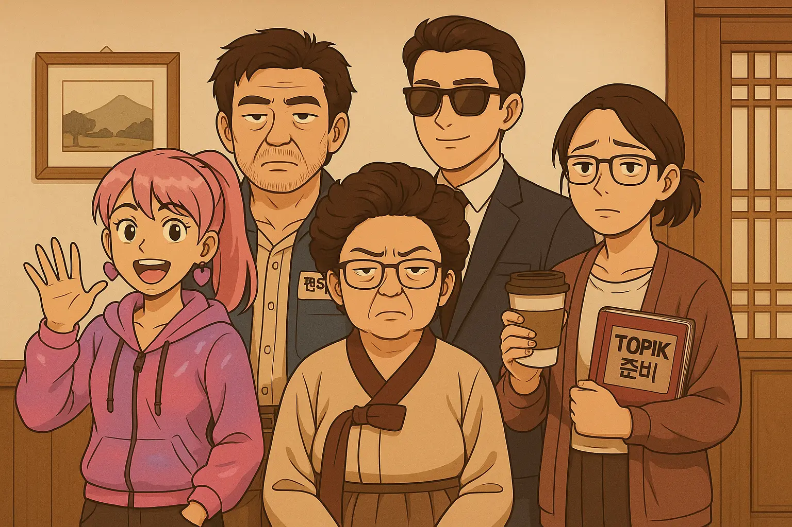

# Korean Learning MUD Game



**Interactive Korean language learning through conversation with AI-powered Korean family members in a retro MUD-style game.**

<div class="section-label">Live Demo</div>

[Play on Hugging Face Spaces](https://huggingface.co/spaces/ramsi-k/korean-cpc-agents)

---

## Project Overview

Built an immersive Korean language learning game that combines retro MUD (Multi-User Dungeon) gameplay with AI-powered conversational agents. Players explore a Korean family house, interact with unique family members, and learn Korean through natural conversations and cultural object examination.

<div class="section-label">Key Innovation</div>

Each family member is an AI agent with distinct personality and teaching style, powered by CrewAI and OpenAI GPT models. The game tracks vocabulary learning progress and prevents repetition for efficient learning.

---

## Key Features

### Game Mechanics

- **6 Explorable Rooms** - Hall, Kitchen, Garden, Bedroom, Study, Classroom
- **5 Unique NPCs** - Each family member teaches different aspects of Korean
- **Interactive Objects** - Examine cultural items to learn vocabulary
- **Retro Terminal Aesthetic** - Brown/tan Korean traditional vibes
- **Progressive Learning** - Smart vocabulary tracking with no repeats
- **Natural Conversation** - Chat naturally with AI agents
- **Inventory System** - Collect examined objects and track progress

### Korean Family Members

| Family Member             | Korean Name     | Room      | Teaching Focus                    |
| ------------------------- | --------------- | --------- | --------------------------------- |
| **Grandma Kim Soon-ja**   | 김순자 할머니   | Kitchen   | Honorifics & Formal Speech        |
| **Grandpa Park Chul-min** | 박철민 할아버지 | Garden    | Traditional Culture & Proverbs    |
| **Sister Lee Min-ji**     | 이민지 언니     | Bedroom   | K-pop & Modern Slang              |
| **Brother Jung Jae-hyun** | 정재현 오빠     | Study     | Grammar & Academic Korean         |
| **Teacher Choi Soo-jin**  | 최수진 선생님   | Classroom | Practical Phrases & Communication |

---

## Architecture & Technical Approach

### System Flow

```text
Player Input
  → FastAPI Backend
  → CrewAI Agent Selection
  → OpenAI GPT Processing
  → Contextual Response
  → Vocabulary Tracking
  → Frontend Update
```

### Technology Stack

- **Backend**: FastAPI + Python
- **AI Agents**: CrewAI with OpenAI GPT models
- **Frontend**: Vanilla HTML/CSS/JavaScript with retro terminal styling
- **Package Management**: uv
- **Game Engine**: Custom MUD-style text adventure system
- **Deployment**: Docker Compose, Hugging Face Spaces

### Game Commands

- `look` - Look around current room
- `go [room]` - Move to another room
- `examine [object]` - Learn Korean vocabulary
- `chat [message]` - Talk to family member
- `help` - Show all commands
- `map` - See house layout

---

## AI Agent Design

### CrewAI Integration

Each family member is a specialized CrewAI agent with:

- **Unique Personality**: Distinct teaching style and conversation patterns
- **Cultural Context**: Appropriate use of honorifics and formality levels
- **Teaching Focus**: Specialized knowledge domain (grammar, slang, culture)
- **Memory**: Tracks conversation history and learning progress

### Conversation System

- Natural language understanding
- Context-aware responses
- Cultural appropriateness
- Vocabulary introduction timing
- Progress-based difficulty adjustment

---

## Learning Features

### Vocabulary Tracking

- Smart tracking prevents word repetition
- Progress visualization
- Inventory of examined objects
- Cultural context for each item

### Progressive Difficulty

- Adapts to player's learning level
- Introduces new concepts gradually
- Reinforces previous learning
- Contextual vocabulary usage

---

## Deployment

### Docker Deployment

```bash
# Clone repository
git clone https://github.com/Ramsi-K/korean-cpc-agents
cd korean-cpc-agents

# Set up environment
echo "OPENAI_API_KEY=your-key" > .env

# Run with Docker Compose
docker compose up --build

# Access at http://localhost:7860
```

### Hugging Face Spaces

- Live demo deployment
- Public access for learners
- Automatic scaling
- Zero setup required

---

## Skills Demonstrated

**Game Design**: MUD-style gameplay, room navigation, inventory system, command parsing

**AI Agent Development**: CrewAI orchestration, personality design, context management, conversation flow

**Natural Language Processing**: Intent recognition, response generation, cultural appropriateness, vocabulary tracking

**Full-Stack Development**: FastAPI backend, vanilla JavaScript frontend, RESTful API design

**Cultural Design**: Korean honorifics system, traditional aesthetics, cultural object curation

**DevOps**: Docker containerization, Hugging Face Spaces deployment, environment management

**UX Design**: Retro terminal styling, intuitive commands, progress visualization

---

## Impact & Use Cases

### Educational Value

- **Immersive Learning**: Learn through natural conversation
- **Cultural Context**: Understand Korean culture alongside language
- **Personalized Pace**: Learn at your own speed
- **Engaging Format**: Game mechanics increase motivation

### Target Audience

- Korean language learners (beginner to intermediate)
- Students interested in Korean culture
- Gamers who enjoy text adventures
- Educators looking for interactive learning tools

---

## Links

- **GitHub**: [korean-cpc-agents](https://github.com/Ramsi-K/korean-cpc-agents)
- **Live Demo**: [Play on Hugging Face](https://huggingface.co/spaces/ramsi-k/korean-cpc-agents)
- **Documentation**: [Full README](https://github.com/Ramsi-K/korean-cpc-agents#readme)

---

[← Back to Projects](index.md)
