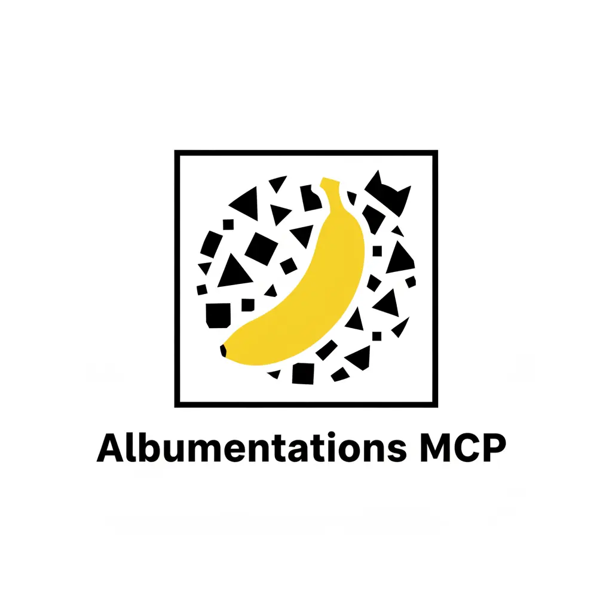

# MCP Albumentations



**Natural language image augmentation via MCP protocol. Transform images using plain English with this production-ready, PyPI-published server.**

<div class="section-label">Usage Example</div>

`"add blur and rotate 15 degrees"` → Applies GaussianBlur + Rotate transforms automatically

---

## Project Overview

Built an MCP-compliant image augmentation server that exposes the Albumentations library through structured JSON tools. The project enables AI agents to perform computer vision augmentations using natural language, with optional VLM integration for semantic verification using Gemini 2.5 Flash ("Nano Banana").

<div class="section-label">Project Status</div>

**Status**: Published to PyPI | **Installation**: `pip install albumentations-mcp` | **License**: MIT

---

## Key Achievements

### Production Deployment

- **Published to PyPI** - Zero-friction installation via `pip` or `uvx`
- **Cross-Platform Support** - Works with Claude Desktop, Kiro IDE, and CLI
- **Enterprise-Ready** - Secure credential management without exposing API keys
- **14 MCP Tools** - 9 core augmentation tools + 5 VLM tools
- **Open Source** - MIT License, Hacktoberfest 2025 participant

### Technical Innovation

#### Natural Language Processing

- Converts English descriptions to structured transforms
- Example: `"increase brightness and add noise"` → `[RandomBrightness, GaussNoise]`
- Supports 20+ transform patterns (goal: 50+)
- Validates prompts without processing images

#### VLM Integration (Gemini 2.5 Flash "Nano Banana")

- Semantic verification of augmentations
- Visual quality assessment
- Image-to-image editing with natural language prompts
- Recipe generation (Albumentations + VLM hybrid pipelines)
- Domain shift and style transfer capabilities

#### 7-Stage Hook System

1. Metadata logging for all augmentation parameters
2. Deterministic seeding for reproducibility
3. Batch processing for efficiency
4. Preset pipeline management
5. Validation and error handling
6. Performance monitoring
7. Session folder organization

---

## Architecture & Design

### MCP Protocol Implementation

```text
AI Agent
  → MCP Client
  → JSON-RPC
  → Augmentation Server
  → Albumentations
  → Output
  → VLM Verification (Optional)
```

### Available Tools (14 Total)

**Core Tools (9):**

- `ping` - Health check with status, version, timestamp
- `load_image_for_processing` - Stage images from URLs/base64
- `augment_image` - Run augmentation pipelines
- `validate_prompt` - Parse prompts without processing
- `list_available_transforms` - Enumerate supported transforms
- `list_available_presets` - Built-in presets (segmentation, portrait, lowlight)
- `get_quick_transform_reference` - Keyword-to-transform guide
- `set_default_seed` - Global reproducibility
- `get_pipeline_status` - Configuration reporting

**VLM Tools (5):**

- `check_vlm_config` - Verify VLM readiness
- `vlm_test_prompt` - Text-to-image preview
- `vlm_generate_preview` - Quick prompt/style ideation
- `vlm_apply` - Direct image-to-image edits
- `vlm_edit_image` - Full session edit flow
- `vlm_suggest_recipe` - Generate hybrid Alb + VLM plans

### Preset Pipelines

Pre-configured workflows for common use cases:

- **Segmentation**: Optimized for semantic segmentation tasks
- **Portrait**: Face-aware augmentations
- **Lowlight**: Brightness and contrast adjustments

---

## Distribution & Integration

### Installation Methods

```bash
# Core only (Albumentations)
pip install albumentations-mcp

# With VLM (Gemini integration)
pip install 'albumentations-mcp[vlm]'

# Run as MCP server
uvx albumentations-mcp
```

### Claude Desktop Configuration

```json
{
  "mcpServers": {
    "albumentations": {
      "command": "uvx",
      "args": ["albumentations-mcp"],
      "env": {
        "OUTPUT_DIR": "./outputs",
        "ENABLE_VLM": "true",
        "DEFAULT_SEED": "42"
      }
    }
  }
}
```

### Kiro IDE Configuration

```json
{
  "mcpServers": {
    "albumentations": {
      "command": "uvx",
      "args": ["albumentations-mcp"],
      "autoApprove": ["augment_image", "list_available_transforms"]
    }
  }
}
```

---

## Key Features & Innovation

### Reproducibility Engineering

- **Deterministic Seeding**: Same seed = same output every time
- **Metadata Logging**: Complete audit trail of all transformations
- **Session Folders**: Organized output structure with timestamps

### Security & Enterprise Readiness

- **No Exposed Secrets**: API keys managed via environment or config files
- **Configurable Access**: Fine-grained control over tool availability
- **Audit Logging**: Track all augmentation operations
- **Regex Security**: Comprehensive security analysis for input validation

### Developer Experience

- **Natural Language Interface**: No need to remember parameter names
- **Comprehensive Documentation**: Built-in guides and examples
- **Error Recovery**: User-friendly error messages with suggestions
- **Quick Reference**: Condensed transform guide for prompting
- **Multi-Source Input**: Local files, base64, and URLs

---

## Skills Demonstrated

**Computer Vision**: Image augmentation, transforms, segmentation, preprocessing pipelines

**MCP Protocol Design**: Tool registration, schema validation, JSON-RPC implementation, cross-platform compatibility

**Software Engineering**: Package distribution (PyPI), CLI design, configuration management, error handling

**MLOps Practices**: Reproducibility, metadata logging, experiment tracking, deterministic workflows

**API Design**: Natural language interfaces, prompt parsing, structured outputs, versioning

**Documentation**: Technical writing, user guides, API references, troubleshooting guides

**Open Source**: Community engagement, contribution guidelines, Hacktoberfest participation

---

## Impact & Adoption

### Use Cases

- **Research**: Reproducible CV experiments across teams
- **Production**: Automated data augmentation pipelines
- **Education**: Teaching computer vision concepts
- **Prototyping**: Rapid augmentation testing with AI agents
- **Domain Shift**: Style transfer and artistic transformations

### Community

- **Open Source**: MIT License, accepting contributions
- **Hacktoberfest 2025**: Active participant
- **Documentation**: Comprehensive guides for contributors
- **Contribution Ideas**: 20+ suggested improvements
- **High-Impact Areas**: Transform mappings, presets, documentation, testing

---

## Links

- **GitHub**: [albumentations-mcp](https://github.com/Ramsi-K/albumentations-mcp)
- **PyPI**: [albumentations-mcp](https://pypi.org/project/albumentations-mcp/)
- **Documentation**: [Full Docs](https://github.com/Ramsi-K/albumentations-mcp/tree/main/docs)
- **Quick Start**: [Setup Guide](https://github.com/Ramsi-K/albumentations-mcp/blob/main/docs/setup.md)
- **Contributing**: [Start Here](https://github.com/Ramsi-K/albumentations-mcp/blob/main/docs/start-here.md)

---

[← Back to Projects](index.md)
