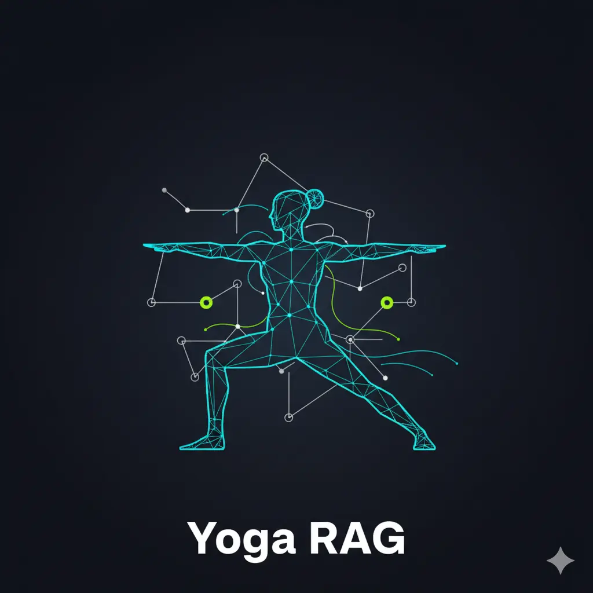

# Yoga Assistant Knowledge RAG



**End-to-end Retrieval-Augmented Generation system for yoga knowledge with rigorous evaluation and production deployment.**

---

## Project Overview

Built a complete RAG system that provides context-aware answers about yoga poses, breathing techniques (pranayama), and sequencing. The project demonstrates full-stack RAG design with systematic retrieval evaluation, LLM benchmarking, and production monitoring.

<div class="section-label">Project Status</div>

**Status**: Complete | **Dataset**: 202 yoga poses | **Test Queries**: 75 ground truth evaluations

---

## Key Achievements

### Retrieval Performance

| Approach                    | Hit Rate | MRR   | Improvement  |
| --------------------------- | -------- | ----- | ------------ |
| BM25 Text Search (baseline) | 76.0%    | 53.5% | -            |
| Vector Search               | 69.3%    | 58.3% | +9% MRR      |
| **Hybrid Weighted Product** | 76.0%    | 66.0% | **+23% MRR** |

<div class="section-label">Key Win</div>

Hybrid search (alpha=0.4) improved ranking by 23% while maintaining BM25's recall.

### LLM Model Evaluation

Benchmarked **5 LLMs** with **3 prompt templates** (15 combinations) on 20 ground truth questions:

| Model + Prompt               | Quality Score | Relevant Answers | Response Time |
| ---------------------------- | ------------- | ---------------- | ------------- |
| **DeepSeek-V3 + structured** | **95.0%**     | 90%              | 9.9s          |
| Qwen2.5-72B + structured     | 85.0%         | 70%              | 6.7s          |
| Llama-3.1-70B + structured   | 82.5%         | 65%              | 2.5s          |

<div class="section-label">Model Selection</div>

Selected DeepSeek-V3 with structured prompting for highest accuracy (90% relevant answers).

### What Didn't Work (Important Lessons)

<div class="section-label">Query Rewriting</div>

**Impact**: -21% MRR, -17% hit rate, +60% latency

- LLM rewrites were too verbose and technical
- Simple user queries outperformed enhanced ones

<div class="section-label">Document Re-ranking</div>

**Impact**: -6.8% MRR, -3.3% hit rate

- Using same embeddings provided no new signal
- Only helps when adding a NEW or BETTER signal

<div class="section-label">Lesson Learned</div>

Not all RAG "best practices" help every system. Always measure before adopting.

---

## Architecture & Technical Approach

### System Flow

```text
User Query
  → Hybrid Retrieval (BM25 + Vector)
  → Context Assembly
  → LLM Generation
  → Response
  → PostgreSQL Logging
  → Grafana Monitoring
```

### Retrieval Strategy

**Hybrid Weighted Product** (optimal configuration):

- **BM25**: All 7 fields (pose name, benefits, contraindications, instructions, etc.)
- **Vector**: all-mpnet-base-v2 (768 dimensions)
- **Fusion**: `score = BM25^0.4 × Vector^0.6`
- **Top-K**: 5 results

### Production Stack

- **Retrieval**: rank-bm25, sentence-transformers
- **LLM**: DeepSeek-V3 via Hyperbolic API
- **Frontend**: Streamlit conversational UI
- **Database**: PostgreSQL 15 (logging + conversation history)
- **Monitoring**: Grafana (7 visualization panels)
- **Deployment**: Docker Compose

---

## Experiments Conducted

### 1. Retrieval Evaluation

- Compared BM25, Vector, and 3 hybrid fusion strategies
- Tested different alpha values (0.0 to 1.0)
- Measured Hit Rate and MRR on 75 test queries

### 2. Query Rewriting Evaluation

- Tested LLM-enhanced query preprocessing
- **Result**: Degraded performance, rejected for production

### 3. Document Re-ranking Evaluation

- Tested vector-based re-ranking on hybrid results
- **Result**: Removed optimized BM25 signal, rejected

### 4. LLM Model Benchmarking

- Evaluated 5 models with 3 prompt templates
- Used LLM-as-a-Judge methodology
- Measured relevance, tokens, and response time

### 5. RAG Pipeline Implementation

- Complete end-to-end flow
- ~1.5s average response time
- ~1,700 tokens per query

---

## Monitoring & Production Features

### Grafana Dashboard (7 Panels)

- Recent conversations table
- User feedback distribution (thumbs up/down)
- Relevance score gauge
- Model usage distribution
- LLM cost tracking over time
- Token usage monitoring
- Response time tracking

### Production Features

- Conversation history persistence
- User feedback system
- Embedding cache for fast startup
- Docker Compose one-command deployment
- Automated database initialization

---

## Key Insights & Lessons

### What Works

- Hybrid search (40% BM25, 60% vector) for small datasets
- Simple user queries over LLM-enhanced rewrites
- Structured prompts across all LLM models
- DeepSeek-V3 for accuracy-critical applications
- Systematic evaluation before production deployment

### What Doesn't Work

- Query rewriting with verbose LLM outputs
- Re-ranking with same embeddings (no new signal)
- Adopting "best practices" without measurement
- Unrealistic targets (90%+) for small datasets

### Research Contributions

- Demonstrated that query rewriting can degrade retrieval performance
- Showed re-ranking only helps with new/better signals
- Validated structured prompts as best across all LLMs
- Proved simple queries outperform enhanced ones for keyword-rich databases

---

## Demonstrated

**RAG System Design**: End-to-end pipeline architecture, retrieval strategy optimization, context assembly

**Evaluation & Benchmarking**: Hit Rate/MRR metrics, LLM-as-a-Judge methodology, systematic A/B testing

**Retrieval Engineering**: Hybrid search algorithms, BM25 tuning, vector embeddings, fusion strategies

**LLM Engineering**: Model selection, prompt engineering, structured output design, API integration

**Production Deployment**: Docker containerization, database design, monitoring dashboards, conversation logging

**Research Methodology**: Hypothesis testing, controlled experiments, reproducible notebooks, findings documentation

---

## Links

- **GitHub**: [yoga-assistant-knowledge-rag](https://github.com/Ramsi-K/yoga-assistant-knowledge-rag)
- **Full Documentation**: [Complete README](https://github.com/Ramsi-K/yoga-assistant-knowledge-rag#readme)
- **Notebooks**: [Jupyter Experiments](https://github.com/Ramsi-K/yoga-assistant-knowledge-rag/tree/main/notebooks)

---

[← Back to Projects](index.md)
